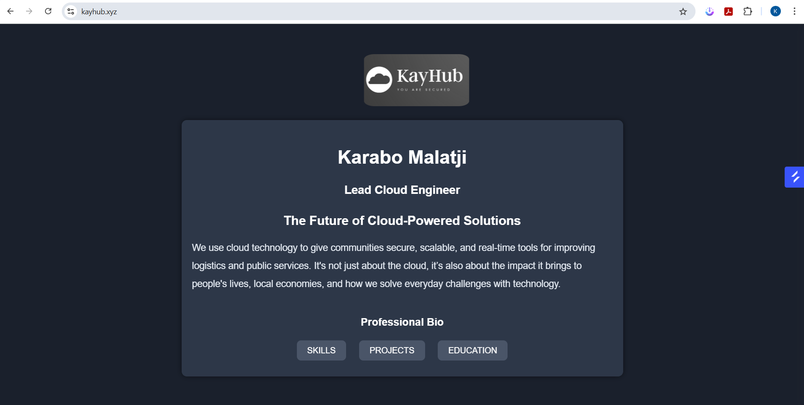

# AltCloud Landing Page Project

This is a dynamic landing page project hosted on AWS EC2, built for the AltSchool of Engineering Tinyuka Second Semester (Cloud) submission.

## 🔧 Technologies Used

- Ubuntu 22.04 (AWS EC2)
- Nginx Web Server
- Tailwind CSS
- HTML5

## 🌐 Live Preview

**Public IP Address:** http://13.48.44.160

## 🛠️ Steps Taken

### 1. Server Provisioning (AWS EC2)
- Launched a t2.micro Ubuntu 22.04 instance on AWS EC2.
- Created and downloaded a key pair `altcloud-key.pem`.

### 2. Web Server Setup
- Installed and started Nginx on the EC2 server.
- Opened port 80 in the AWS security group to allow HTTP traffic.

### 3. Dynamic Landing Page
- Replaced default Nginx page with a custom HTML page.
- Used  CSS CDN for styling.
- Content includes:
  - Name: Karabo Malatji
  - Role: Lead Cloud Engineer
  - Project Title: The Future of Cloud-Powered Solutions
  - Short Pitch and Professional Bio

### 4. Deployment
- The HTML page is served via Nginx at the public IP above.

## 👨‍💻 Author

**Karabo Malatji**  
Cloud Engineering Student, AltSchool of Engineering
